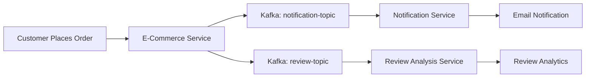

# E-Commerce Platform

A complete microservices-based e-commerce platform built with Spring Boot and Python, featuring product management, order processing, notifications, and customer review analysis.

## 🏗️ Architecture

This platform consists of three main services:

### 1. **E-Commerce Core Service** (Java/Spring Boot)
- Main e-commerce backend with REST APIs
- Product catalog and inventory management
- Customer management and authentication
- Shopping cart and order processing
- Database management with Liquibase migrations

### 2. **Notification Service** (Java/Spring Boot)
- Handles order notifications via Kafka
- Email notifications using SendGrid
- Real-time notification processing

### 3. **Customer Review Analysis Service** (Python/FastAPI)
- Processes customer reviews from Kafka
- Sentiment analysis and feedback processing
- Review insights and analytics

## 🚀 Technologies

### Backend Stack
- **Java 22** with Spring Boot 4.0.0-M3
- **Python 3.x** with FastAPI
- **Apache Kafka** for event streaming
- **MySQL** for data persistence
- **Liquibase** for database migrations

### Key Dependencies
- Spring Data JPA & Hibernate
- Spring Kafka
- ModelMapper & Lombok
- SendGrid for email notifications
- SQLAlchemy & PyMySQL for Python services

## 📋 Features

### Core E-Commerce Features
- ✅ Customer registration and management
- ✅ Product catalog with variants (size, color, etc.)
- ✅ Shopping cart functionality
- ✅ Order processing with inventory management
- ✅ Product reviews and ratings
- ✅ Real-time notifications

### Advanced Features
- 🔄 **Event-Driven Architecture** with Kafka
- 🔒 **Optimistic Locking** for data consistency
- 📊 **Review Analytics** with sentiment analysis
- 📧 **Email Notifications** for orders
- 🗄️ **Database Versioning** with Liquibase
- 📖 **API Documentation** with OpenAPI/Swagger

## 🛠️ Quick Start

### Prerequisites
- Java 22+
- Python 3.8+
- MySQL 8.0+
- Apache Kafka
- Maven 3.6+

### 1. Start Infrastructure Services
```bash
# Start Kafka and Zookeeper
docker-compose up -d
```

### 2. Setup Database
```bash
# Create MySQL database
mysql -u root -p
CREATE DATABASE ecommerce;
```

### 3. Run E-Commerce Core Service
```bash
cd e-comm
./mvnw spring-boot:run
```
The service will be available at `http://localhost:8080`

### 4. Run Notification Service
```bash
cd notificationService
./mvnw spring-boot:run
```

### 5. Run Customer Review Analysis Service
```bash
cd customerReviewAnalysis
pip install -r requirements.txt
cd app
python main.py
```

## 📚 API Documentation

### Base URL
```
http://localhost:8080
```

### Key Endpoints

#### Customer Management
- `POST /api/customer/create` - Create new customer
- `GET /api/customer/{id}` - Get customer details
- `PUT /api/customer/update` - Update customer
- `DELETE /api/customer/delete/{id}` - Delete customer

#### Product Management (Admin)
- `POST /api/admin/product/create` - Create product
- `GET /api/admin/product/all` - List all products
- `PUT /api/admin/product/update` - Update product
- `DELETE /api/admin/product/delete/{id}` - Delete product

#### Shopping Cart
- `POST /api/cart/create/{customerId}` - Create cart
- `POST /api/cart/{customerId}/add-item` - Add item to cart
- `PUT /api/cart/{customerId}/update-item` - Update cart item
- `DELETE /api/cart/{customerId}/clear` - Clear cart

#### Orders
- `POST /api/order/create/{customerId}` - Create order
- `GET /api/order/customer/{customerId}` - Get customer orders
- `GET /api/order/all` - Get all orders

#### Reviews
- `POST /api/review/create/{customerId}` - Create product review
- `GET /api/review/product/{productVariantId}` - Get product reviews

### Interactive API Documentation
Visit `http://localhost:8080/swagger-ui.html` for interactive API documentation.

## 🔧 Configuration

### Database Configuration
Update `e-comm/src/main/resources/application.yml`:
```yaml
spring:
  datasource:
    url: jdbc:mysql://localhost:3306/ecommerce
    username: your_username
    password: your_password
```

### Kafka Configuration
Kafka runs on `localhost:9092` by default. Update configuration in:
- `e-comm/src/main/resources/application.yml`
- `notificationService/src/main/resources/application.yml`

### Email Configuration (SendGrid)
Add your SendGrid API key to notification service configuration.

## 📊 Event Flow



## 🗄️ Database Schema

### Core Entities
- **Customer** - User information and profiles
- **Product** - Product catalog
- **ProductVariant** - Product variations (size, color, price)
- **ShoppingCart** - Customer shopping carts
- **Order** - Customer orders with items
- **ProductReview** - Customer feedback and ratings
- **Notification** - System notifications

## 🧪 Testing

### Test the APIs
```bash
# Create a customer
curl -X POST http://localhost:8080/api/customer/create \
  -H "Content-Type: application/json" \
  -d '{
    "firstName": "John",
    "lastName": "Doe",
    "email": "john@example.com",
    "address": "123 Main St",
    "phoneNumber": "+1234567890"
  }'

# Create a product
curl -X POST http://localhost:8080/api/admin/product/create \
  -H "Content-Type: application/json" \
  -d '{
    "title": "T-Shirt",
    "description": "Cotton T-Shirt",
    "category": "Clothing",
    "productVariantDtoList": [{
      "size": "M",
      "stock": 100,
      "sku": "TSH-M-001",
      "price": 29.99
    }]
  }'
```

## 🚀 Deployment

### Docker Deployment
Each service can be containerized using Docker. Example Dockerfile for the main service:

```dockerfile
FROM openjdk:22-jdk-slim
COPY target/e-comm-1.0-SNAPSHOT.jar app.jar
EXPOSE 8080
ENTRYPOINT ["java", "-jar", "/app.jar"]
```

### Production Considerations
- Configure proper database connection pooling
- Set up Kafka cluster for high availability
- Implement proper logging and monitoring
- Configure SSL/TLS for secure communication
- Set up load balancing for multiple instances

## 🤝 Contributing

1. Fork the repository
2. Create a feature branch (`git checkout -b feature/amazing-feature`)
3. Commit your changes (`git commit -m 'Add amazing feature'`)
4. Push to the branch (`git push origin feature/amazing-feature`)
5. Open a Pull Request

## 📝 License

This project is licensed under the MIT License - see the LICENSE file for details.

## 📞 Support

For support and questions:
- Create an issue in the repository
- Check the API documentation at `/swagger-ui.html`
- Review the existing documentation in `e-comm/API_DOCUMENTATION.md`

---

**Built with ❤️ using Spring Boot, FastAPI, and Apache Kafka**


